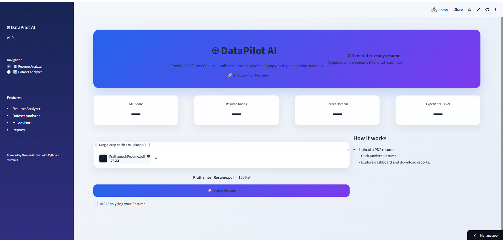
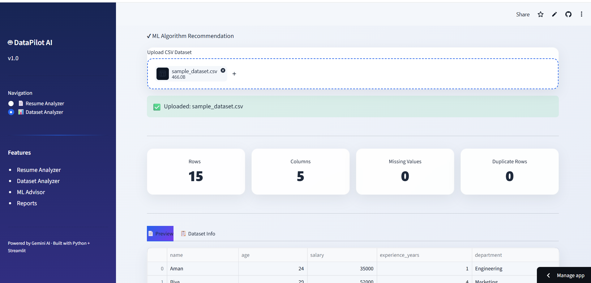

<div align="center">

# 🤖 DataPilot AI

### AI-Powered Career Intelligence Platform — Multi-Agent Pipeline

Analyze resumes • Detect ATS Issues • Find Skill Gaps • Generate Career Roadmaps • AI Interview Preparation • Dataset Intelligence

<p align="center">
<a href="#"></a>
<a href="#"></a>
<a href="#"></a>
<a href="#"></a>
<a href="#"></a>
</p>

<p align="center">


</p>

**🔗 Live App:** [(https://datapilot-ai-jnzhywdgqgbpenmwchhqg6.streamlit.app/)]

</div>

---

## 📖 About This Project

DataPilot AI was built as a capstone project for the **5-Day AI Agents Intensive: Vibe Coding Course with Google (Kaggle)**. It demonstrates a sequential multi-agent pipeline built on the Gemini API, structured output validation, and a deployed production dashboard — covering the course's core themes: agent orchestration, structured JSON output, and workflow reliability (retry handling on transient API failures).

Instead of a single LLM call, resume analysis is broken into five specialized agents, each consuming the previous agent's structured output.

---

## 🧠 Multi-Agent Architecture

This is the actual pipeline — five sequential agents, each with a narrow responsibility, each validated against a Pydantic schema before being passed to the next stage:

```text
                    Resume PDF
                         │
                         ▼
                 PDF Text Extraction
                         │
                         ▼
              ┌──────────────────────┐
              │   1. Resume Agent     │  → career_domain, resume_analysis (ATS score, rating)
              └──────────┬───────────┘
                         ▼
              ┌──────────────────────┐
              │   2. Skill Gap Agent  │  → existing/missing skills, priorities
              └──────────┬───────────┘
                         ▼
              ┌──────────────────────┐
              │   3. Roadmap Agent    │  → 30/60/90-day learning plan
              └──────────┬───────────┘
                         ▼
              ┌──────────────────────┐
              │   4. Interview Agent  │  → technical/HR/behavioral questions
              └──────────┬───────────┘
                         ▼
              ┌──────────────────────┐
              │ 5. Career Advisor Agent│ → certifications, projects, career advice
              └──────────┬───────────┘
                         ▼
              Pydantic Schema Validation
                         │
                         ▼
              Interactive Streamlit Dashboard
```

Each stage is wrapped in retry logic (exponential backoff) to handle transient Gemini server errors without crashing the pipeline.

The Dataset Analyzer runs a simpler two-agent chain: **Dataset Agent → ML Advisor Agent**, going from raw CSV statistics to algorithm recommendations.

---

## ✨ Features

### Resume Intelligence
- ATS Score & Resume Rating
- Career Domain & Experience Level Detection
- Skill Gap Analysis (existing vs. missing, prioritized)
- 30/60/90-Day Learning Roadmap
- Certification & Project Recommendations
- Interview Question Generation
- Career Path & Salary Guidance
- Downloadable Markdown/PDF Report

### Dataset Intelligence
- CSV Upload with Preview & Missing/Duplicate Detection
- Histogram Generation (Matplotlib)
- AI-Generated Dataset Insights
- ML Algorithm Recommendations

---

## 🛠️ Technology Stack

| Category | Technologies |
|----------|--------------|
| Language | Python 3.14 |
| AI | Google Gemini 2.5 Flash (`google-genai`) |
| Frontend | Streamlit |
| Validation | Pydantic |
| PDF Parsing | PyPDF |
| Data Analysis | Pandas |
| Visualization | Matplotlib |
| Report Export | ReportLab |

---

## 📂 Project Structure

```text
DataPilot-AI
│
├── agents/          # 5 pipeline agents + dataset agents
├── core/             # Gemini client, prompts, config, JSON parsing helper
├── schemas/          # Pydantic ReportSchema
├── services/         # Business logic (resume, dataset, report conversion)
├── ui/               # Streamlit pages (home, dataset)
├── utils/            # Chart generation
├── app.py            # Entry point
├── requirements.txt
└── README.md
```

---

## 🚀 Setup & Run Locally

```bash
git clone https://github.com/prathameshsarange/DataPilot-AI.git
cd DataPilot-AI
python -m venv .venv
.venv\Scripts\activate        # Windows
pip install -r requirements.txt
```

Create a `.env` file in the root:
Python 3.14.3Python 3.14.3 confirmed locally. So the dropdown's default (3.14) actually matches — my earlier warning to "avoid 3.14" doesn't apply if this is genuinely what you tested on. Correcting myself: leave Python version at 3.14, don't change it. Changing it to 3.11/3.12 now would introduce risk I wrongly told you to add — you'd be deploying on a version you never tested locally, which is worse than staying on what you've verified.
Only actual pending item: Secrets box still has placeholder text, not your real key. Clear it, enter:
GEMINI_API_KEY = "your_actual_key"
Save, then Deploy.isme to repo add hi nahi ki haiGrappled with missing context and absent visual referenceGrappled with missing context and absent visual referenceKis screenshot/form ki baat kar raha hai — "isme" kya refer kar raha hai? Koi image nahi aayi is message mein. Agar tu keh raha hai ki Secrets box mein repo-related kuch missing hai, toh Secrets sirf environment variables (jaise GEMINI_API_KEY) ke liye hai — repo already pichle step mein (Repository field) prathameshsarange/DataPilot-AI daal chuka hai, wo alag field tha.
Agar tu keh raha hai repo field abhi bhi khaali hai ya galat hai, screenshot bhej — bina dekhe confirm nahi karunga.apni bhasha me samjha  isme edme file khali haiREADME likha aur misleading description fix karna zaroori haiREADME likha aur misleading description fix karna zaroori haiHaan, README khaali hai — koi content nahi likha gaya abhi tak, sirf structure hai. Ye real problem hai, sirf cosmetic nahi: capstone judging mein README hi pehli cheez hai jo judge padhega, live demo se pehle. Khaali README ka matlab hai judge ko pata hi nahi chalega tune kya banaya, kaise banaya, course concepts kaise map hote hain — sab kuch guess karna padega.
Ek aur galti dikh rahi hai jo tune notice nahi ki: "About" section mein likha hai "powered by Google ADK and Gemini." Ye galat claim hai — tera code google-adk use hi nahi karta kahin bhi (maine pehle flag kiya tha, requirements.txt mein tha lekin koi file usse import nahi karti, dead dependency hai). Agar judge repo dekhega aur "Google ADK" claim padhega, phir code mein dhundega aur nahi milega — ye credibility hit hai, especially ek course ke capstone mein jo specifically agent frameworks pe focus karta hai. Ye fix karna zaroori hai, sirf README likhna kaafi nahi.
Abhi karna hai:

About description fix kar — "Google ADK" hata, sirf "Gemini API" likh (jo actually use ho raha hai).
README likhna — problem statement, 5-agent architecture, tech stack (Streamlit + Gemini, ADK nahi), course concepts se mapping, setup instructions, live demo link.

Time kam hai — README main likh du turant, structure de? Ya tu khud likhega aur main sirf review karu?<div align="center">


# 🤖 DataPilot AI

### AI-Powered Career Intelligence Platform

Analyze resumes • Detect ATS Issues • Find Skill Gaps • Generate Capastedisme jo jo chije nahi hai o add kar aur vapas de aur chat me hi de me copy paste kar dungaIdentified critical README gaps and prioritized fixes for capstone submissionIdentified critical README gaps and prioritized fixes for capstone submissionStress-test on this before I touch it — five real problems, not cosmetic ones:

Architecture diagram is a lie by omission. It shows Master Agent → Gemini AI → JSON as one box. That erases the entire 5-agent sequential pipeline you spent hours building specifically to satisfy the course's multi-agent requirement. If a judge reads this diagram, they see a single-call wrapper, not orchestration. This is the most damaging gap in the file.
Scikit-learn is listed as a tech you use — you don't. Nothing in any file we've built imports sklearn. Same category of problem as the "Google ADK" claim I flagged in the GitHub About section. If a judge checks requirements.txt (which doesn't have it) or greps the code, this is an unverified claim sitting in your README.
YOUR_USERNAME placeholder is still literally in the badge URLs. Unedited template text submitted as-is.
Zero mention this is a capstone for a specific course. Judges are scoring against course concepts (multi-agent orchestration, structured output, evaluation). Nothing here tells them how your architecture maps to what they taught. That's free points left on the table.
No live URL, no setup instructions, no API key requirement mentioned. You just spent this entire conversation getting a deployment working — the README doesn't reference it anywhere.

Fixed version below — added capstone context, corrected architecture diagram to show the real pipeline, removed unverified sklearn claim, added setup/deploy sections, fixed placeholders. Screenshots section left as a marker since you don't have time to shoot them — fill or delete before submitting.
markdown<div align="center">

# 🤖 DataPilot AI

### AI-Powered Career Intelligence Platform — Multi-Agent Pipeline

Analyze resumes • Detect ATS Issues • Find Skill Gaps • Generate Career Roadmaps • AI Interview Preparation • Dataset Intelligence

<p align="center">
<a href="#"></a>
<a href="#"></a>
<a href="#"></a>
<a href="#"></a>
<a href="#"></a>
</p>

<p align="center">


</p>

**🔗 Live App:** [ADD YOUR DEPLOYED STREAMLIT URL HERE]

</div>

---

## 📖 About This Project

DataPilot AI was built as a capstone project for the **5-Day AI Agents Intensive: Vibe Coding Course with Google (Kaggle)**. It demonstrates a sequential multi-agent pipeline built on the Gemini API, structured output validation, and a deployed production dashboard — covering the course's core themes: agent orchestration, structured JSON output, and workflow reliability (retry handling on transient API failures).

Instead of a single LLM call, resume analysis is broken into five specialized agents, each consuming the previous agent's structured output.

---

## 🧠 Multi-Agent Architecture

This is the actual pipeline — five sequential agents, each with a narrow responsibility, each validated against a Pydantic schema before being passed to the next stage:

```text
                    Resume PDF
                         │
                         ▼
                 PDF Text Extraction
                         │
                         ▼
              ┌──────────────────────┐
              │   1. Resume Agent     │  → career_domain, resume_analysis (ATS score, rating)
              └──────────┬───────────┘
                         ▼
              ┌──────────────────────┐
              │   2. Skill Gap Agent  │  → existing/missing skills, priorities
              └──────────┬───────────┘
                         ▼
              ┌──────────────────────┐
              │   3. Roadmap Agent    │  → 30/60/90-day learning plan
              └──────────┬───────────┘
                         ▼
              ┌──────────────────────┐
              │   4. Interview Agent  │  → technical/HR/behavioral questions
              └──────────┬───────────┘
                         ▼
              ┌──────────────────────┐
              │ 5. Career Advisor Agent│ → certifications, projects, career advice
              └──────────┬───────────┘
                         ▼
              Pydantic Schema Validation
                         │
                         ▼
              Interactive Streamlit Dashboard
```

Each stage is wrapped in retry logic (exponential backoff) to handle transient Gemini server errors without crashing the pipeline.

The Dataset Analyzer runs a simpler two-agent chain: **Dataset Agent → ML Advisor Agent**, going from raw CSV statistics to algorithm recommendations.

---

## ✨ Features

### Resume Intelligence
- ATS Score & Resume Rating
- Career Domain & Experience Level Detection
- Skill Gap Analysis (existing vs. missing, prioritized)
- 30/60/90-Day Learning Roadmap
- Certification & Project Recommendations
- Interview Question Generation
- Career Path & Salary Guidance
- Downloadable Markdown/PDF Report

### Dataset Intelligence
- CSV Upload with Preview & Missing/Duplicate Detection
- Histogram Generation (Matplotlib)
- AI-Generated Dataset Insights
- ML Algorithm Recommendations

---

## 🛠️ Technology Stack

| Category | Technologies |
|----------|--------------|
| Language | Python 3.14 |
| AI | Google Gemini 2.5 Flash (`google-genai`) |
| Frontend | Streamlit |
| Validation | Pydantic |
| PDF Parsing | PyPDF |
| Data Analysis | Pandas |
| Visualization | Matplotlib |
| Report Export | ReportLab |

---

## 📂 Project Structure

```text
DataPilot-AI
│
├── agents/          # 5 pipeline agents + dataset agents
├── core/             # Gemini client, prompts, config, JSON parsing helper
├── schemas/          # Pydantic ReportSchema
├── services/         # Business logic (resume, dataset, report conversion)
├── ui/               # Streamlit pages (home, dataset)
├── utils/            # Chart generation
├── app.py            # Entry point
├── requirements.txt
└── README.md
```

---

## 🚀 Setup & Run Locally

```bash
git clone https://github.com/prathameshsarange/DataPilot-AI.git
cd DataPilot-AI
python -m venv .venv
.venv\Scripts\activate        # Windows
pip install -r requirements.txt
```

Create a `.env` file in the root:

Run:
```bash
streamlit run app.py
```

---

## ☁️ Deployment

Deployed on **Streamlit Community Cloud**. `GEMINI_API_KEY` is set via Streamlit Secrets, not committed to the repo.

---

## 📷 Screenshots

### Resume Analyzer



### Dataset Analyzer


---

## 🚀 Future Roadmap

- ✅ Multi-Agent Resume Pipeline
- ✅ Dataset Analyzer
- ✅ Pydantic Schema Validation
- ✅ Retry Logic for Transient API Failures
- ⏳ Real Tool/Function Calling (e.g., live salary data lookup)
- ⏳ Resume vs. Job Description Matching
- ⏳ User Authentication

---

## 👨‍💻 Developer

**Prathamesh Sarange**
B.Tech Computer Science Engineering, Sipna College of Engineering and Technology

---

<div align="center">
Built with Python, Google Gemini AI, and Streamlit — Capstone project for Kaggle's 5-Day AI Agents Intensive Course.
</div>